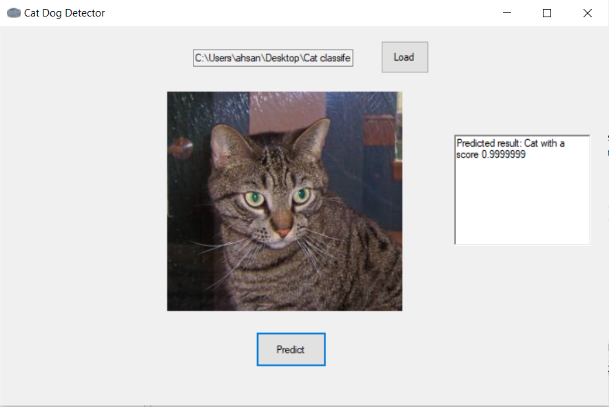
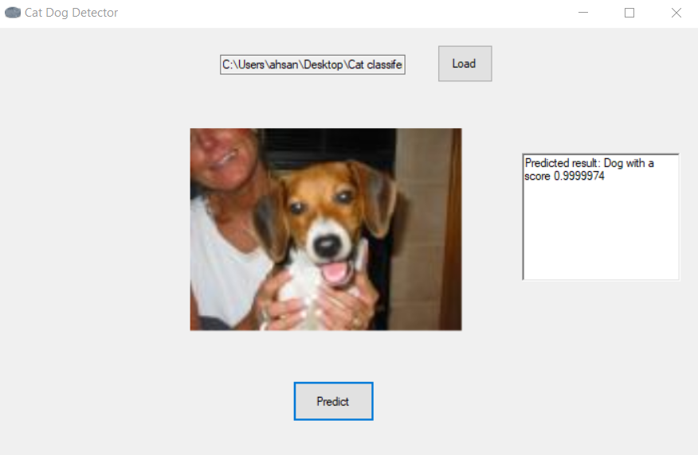

# Cat-Dog-Detector
An ML.NET based application trained on the Kaggle Cat Dog Dataset that predicts whether the given image is of a Dog or a Cat.

## Overview
I made a simple windows forms application to classify images of cats and dogs. The purpose of this application was to see test out the ML.NET framework.
The Classification model was trained using a DNN+resnet50 architecture. The Cat Dog Dataset used to trained the model comprised of 12000 images each approx. 

### Screenshot of the Application

#### Cat Detection

#### Dog Detection

